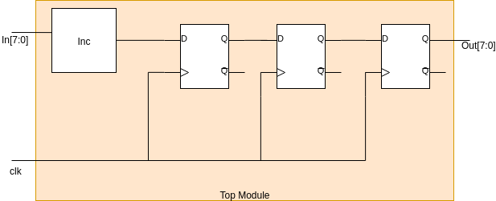

# fundamentos_verilog

Este repositorio contiene algunos ejemplos para familiarizarse con el uso de verilog.
Se incluyen los siguientes ejemplos:
## Lógica Combinacional
AND, AND16, Mux8Way16
## Lógica Secuencial
Latch y Flip-Flop

Cada uno con su respectivo Testbench.

### Tarea:
Implementar el circuito que se muestra en la imagen. Para ello se dan dos archivos: file.v contiene la plantilla del modulo top a generar y tb_file.v el testbench del modulo top que usted desarrollará.
Image 
